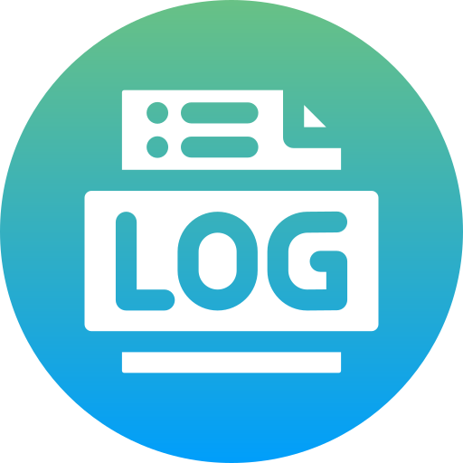

 

# Logger in Go

## Description

This project is a simple logger written in the Go programming language. The logger allows you to log messages with various levels of importance (informational, warnings, errors, etc.) to a file and to the console.

## Installation

To install the logger, run the following command:

```sh
go get github.com/nir0k/logger
```

## Usage

Example of using the logger:

```go
package main

import (
    "github.com/nir0k/logger"
)

func main() {
    config := logger.LogConfig{
        Directory:     "./logs",
        Format:        "standard", // or "json"
        Level:         "trace",
        ConsoleOutput: true,
        EnableRotation: true,
        RotationConfig: logger.RotationConfig{
            MaxSize:    10,   // 10 MB
            MaxBackups: 3,    // Keep up to 3 backup copies
            MaxAge:     7,    // Keep logs for 7 days
            Compress:   true, // Compress archives on rotation
        },
    }

    log, err := logger.NewLogger(config)
    if err != nil {
        panic(err)
    }

    log.Trace("TRACE level message")
    log.Debug("Debug message")
    log.Info("Informational message")
    log.Warning("Warning")
    log.Error("Error message")
    // log.Fatal("Critical error, application will terminate")

    log.Tracef("TRACE level message: %d", 1)
    log.Debugf("Debug message: %d", 2)
    log.Infof("Informational message: %d", 3)
    log.Warningf("Warning message: %d", 4)
    log.Errorf("Error message: %d", 5)
    // log.Fatalf("Critical error, application will terminate: %d", 6)

    log.Traceln("TRACE level message with newline")
    log.Debugln("Debug message with newline")
    log.Infoln("Informational message with newline")
    log.Warningln("Warning message with newline")
    log.Errorln("Error message with newline")
    // log.Fatalln("Critical error, application will terminate with newline")
}
```

## Log Rotation
The logger supports log file rotation, which allows you to control the size and number of logs, as well as automatically delete outdated files. Rotation is configured through the RotationConfig structure in the configuration.

### Rotation Parameters:

- `MaxSize`: Maximum log file size in megabytes before rotation occurs.
- `MaxBackups`: Maximum number of backup log files to keep.
- `MaxAge`: Maximum number of days to keep old logs.
- `Compress`: Compress archives on rotation (true/false).

## Logging Levels

- `trace`: Detailed information for debugging.
- `debug`: Debug messages.
- `info`: Informational messages about the normal operation of the application.
- `warning`: Warnings about potential issues.
- `error`: Errors that require attention.
- `fatal`: Critical errors after which the application may terminate.

## Logging Formats
The logger supports two output formats:

- `standard`: Human-readable format with timestamps and logging levels.
- `json`: JSON format for machine processing of logs.

## Console Output
For development convenience, the logger can output messages not only to a file but also to the console. This is configured through the ConsoleOutput field in the configuration.

- `ConsoleOutput: true` — console output enabled.
- `ConsoleOutput: false` — console output disabled.