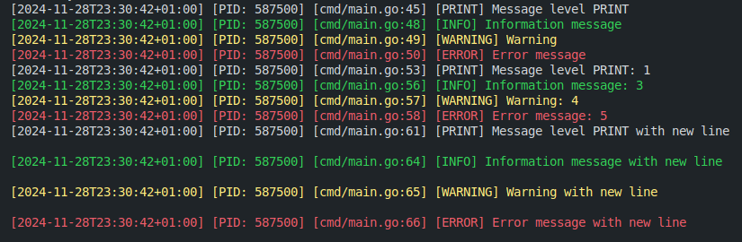

 

# Logger in Go

## Description

This project is a customizable logger written in the Go programming language. The logger allows you to log messages with various levels of importance (trace, debug, info, warning, error, fatal) to a file and/or to the console. It supports different log formats, log rotation, and allows specifying log levels using either strings or numeric values.

## Installation

To install the logger, run the following command:

```sh
go get github.com/nir0k/logger
```

## Usage

Example of using the logger:

```go
package main

import (
    "github.com/nir0k/logger"
)

func main() {
    config := logger.LogConfig{
        FilePath:      "./logs/app.log",   // Path to the log file
        Format:        "standard",         // or "json"
        FileLevel:     "debug",            // Log level for file output (string or int)
        ConsoleLevel:  1,                  // Log level for console output (string or int)
        ConsoleOutput: true,               // Enable console output
        EnableRotation: true,              // Enable log rotation
        RotationConfig: logger.RotationConfig{
            MaxSize:    10,   // 10 MB
            MaxBackups: 3,    // Keep up to 3 backup copies
            MaxAge:     7,    // Keep logs for 7 days
            Compress:   true, // Compress archives on rotation
        },
    }

    // Initialize the logger with the configuration
    err := logger.InitLogger(config)
    if err != nil {
        // Handle the error (error messages are also printed to the console)
        panic(err)
    }

    // Using the logger
    logger.Print("Message level PRINT")
    logger.Trace("Message level TRACE")
    logger.Debug("Message level Debug")
    logger.Info("Information message")
    logger.Warning("Warning")
    logger.Error("Error message")
    // logger.Fatal("Critical error, the application will terminate")
    
    logger.Printf("Message level PRINT: %d", 1)
    logger.Tracef("Message level TRACE: %d", 1)
    logger.Debugf("Message level Debug: %d", 2)
    logger.Infof("Information message: %d", 3)
    logger.Warningf("Warning: %d", 4)
    logger.Errorf("Error message: %d", 5)
    // logger.Fatalf("Critical error, the application will terminate: %d", 6)

    logger.Println("Message level PRINT with new line")
    logger.Traceln("Message level TRACE with new line")
    logger.Debugln("Message level Debug with new line")
    logger.Infoln("Information message with new line")
    logger.Warningln("Warning with new line")
    logger.Errorln("Error message with new line")
    // logger.Fatalln("Critical error, the application will terminate with new line")
}

```
 


**Note**: The `log.Fatal` lines are commented out because they will terminate the application immediately after logging the message.


## Using an Instance of Logger (Optional)
If you prefer to use an instance of the logger rather than the package-level functions, you can create a new logger instance:
```go
package main

import (
    "github.com/nir0k/logger"
)

func main() {
    config := logger.LogConfig{
        FilePath:      "./logs/app.log",
        Format:        "standard",
        FileLevel:     "debug",
        ConsoleLevel:  "debug",
        ConsoleOutput: true,
        EnableRotation: true,
        RotationConfig: logger.RotationConfig{
            MaxSize:    10,
            MaxBackups: 3,
            MaxAge:     7,
            Compress:   true,
        },
    }

    // Create a new logger instance
    logInstance, err := logger.NewLogger(config)
    if err != nil {
        // Handle the error (error messages are also printed to the console)
        panic(err)
    }

    // Use the logger instance
    logInstance.Trace("TRACE level message")
    logInstance.Debug("Debug message")
    logInstance.Info("Informational message")
    logInstance.Warning("Warning")
    logInstance.Error("Error message")
    // logInstance.Fatal("Critical error, application will terminate")

    // ... (similar for other log methods)
}
```

## LogConfig Parameters
The `LogConfig` structure provides flexible configuration for the logger. Below is a description of each parameter:
```go
type LogConfig struct {
    FilePath       string         // Full path to the log file.
    Format         string         // Log format: "standard" or "json".
    FileLevel      interface{}    // Log level for file output: can be string or int.
    ConsoleLevel   interface{}    // Log level for console output: can be string or int.
    ConsoleOutput  bool           // Whether to output logs to the console.
    EnableRotation bool           // Whether to enable log rotation.
    RotationConfig RotationConfig // Settings for log rotation.
}
```
**Parameters**

1. **FilePath** (Optional)
    - **Type**: `string`
    - **Description**: The full path to the log file where log messages will be stored. If left empty, logging to a file will be disabled.
    - **Example**: `./logs/app.log`

2. **Format** (Optional)
    - **Type**: `string`
    - **Description**: Specifies the format of the log output. Can be `"standard"` for a human-readable format or `"json"` for structured logging.
    - **Default**: `"standard"`
    - **Example**: `"json"`

3. **FileLevel** (Optional)
    - **Type**: interface{} (can be `string` or `int`)
    - **Description**: Sets the minimum log level for messages that are written to the log file. Accepts either a string (e.g., `"info"`) or an integer (e.g., `2`). Refer to the Logging Levels section for valid values.
    - **Default**: `"warning"`
    - **Example**: `"debug"` or `1`

4. **ConsoleLevel** (Optional)
    - **Type**: interface{} (can be `string` or `int`)
    - **Description**: Sets the minimum log level for messages that are displayed in the console. Accepts either a string or integer format. If not specified, defaults to `"warning"`.
    - **Default**: `"warning"`
    - **Example**: `0` (trace level) or `"info"`

5. **ConsoleOutput** (Optional)
    - **Type**: `bool`
    - **Description**: Determines if log messages should also be output to the console.
    - **Default**: `false`
    - **Example**: `true`

6. **EnableRotation** (Optional)
    - **Type**: `bool`
    - **Description**: Enables log rotation to manage the size of log files and keep them within specified limits.
    - **Default**: `false`
    - **Example**: `true`

7. **RotationConfig** (Optional, used only if EnableRotation is true)
    - **Type**: `RotationConfig`
    - **Description**: Contains settings for log rotation, such as maximum size, number of backups, retention days, and compression.
    - **Default**: Uses the default values within `RotationConfig`.

## Log Levels
You can specify log levels either as strings or integers:

- As strings: `"trace"`, `"debug"`, `"info"`, `"warning"`, `"error"`, `"fatal"`
- As integers:

- `0`: `trace`
- `1`: `debug`
- `2`: `info`
- `3`: `warning`
- `4`: `error`
- `5`: `fatal`
For example:
```go
config := logger.LogConfig{
    FileLevel:    "info", // Using string
    ConsoleLevel: 1,      // Using integer
}
```

## Log Rotation
The logger supports log file rotation to manage log file sizes and retention.

### Rotation Parameters:
The `RotationConfig` structure controls how log rotation is handled when `EnableRotation` is set to `true`.
```go
type RotationConfig struct {
    MaxSize    int  // Maximum size in megabytes before log rotation.
    MaxBackups int  // Maximum number of old log files to retain.
    MaxAge     int  // Maximum number of days to retain old log files.
    Compress   bool // Whether to compress rotated log files.
}
```

1. **MaxSize** (Optional)
    - **Type**: `int`
    - **Description**: Sets the maximum size (in megabytes) that a log file can reach before it is rotated.
    - **Default**: `10` MB
    - **Example**: `50`

2. **MaxBackups** (Optional)
    - **Type**: `int`
    - **Description**: The maximum number of backup log files to keep. When the limit is reached, the oldest log file will be deleted.
    - **Default**: `7`
    - **Example**: `5`

3. **MaxAge** (Optional)
    - **Type**: `int`
    - **Description**: Maximum number of days to keep old log files. After this period, old files are deleted.
    - **Default**: `30` days
    - **xample**: `15`

4. **Compress** (Optional)
    - **Type**: `bool`
    - **Description**: Enables compression for rotated log files, which helps reduce disk space usage.
    - **Default**: `false`
    - **Example**: `true`

## Logging Formats
The logger supports two output formats:

- `standard`: Human-readable format with timestamps and logging levels.
- `json`: JSON format for machine processing of logs.

## Console Output
For development convenience, the logger can output messages not only to a file but also to the console. This is configured through the ConsoleOutput field in the configuration.

- `ConsoleOutput: true` — console output enabled.
- `ConsoleOutput: false` — console output disabled.